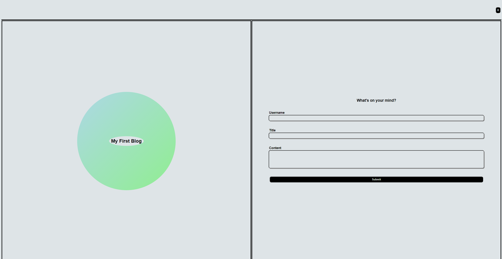
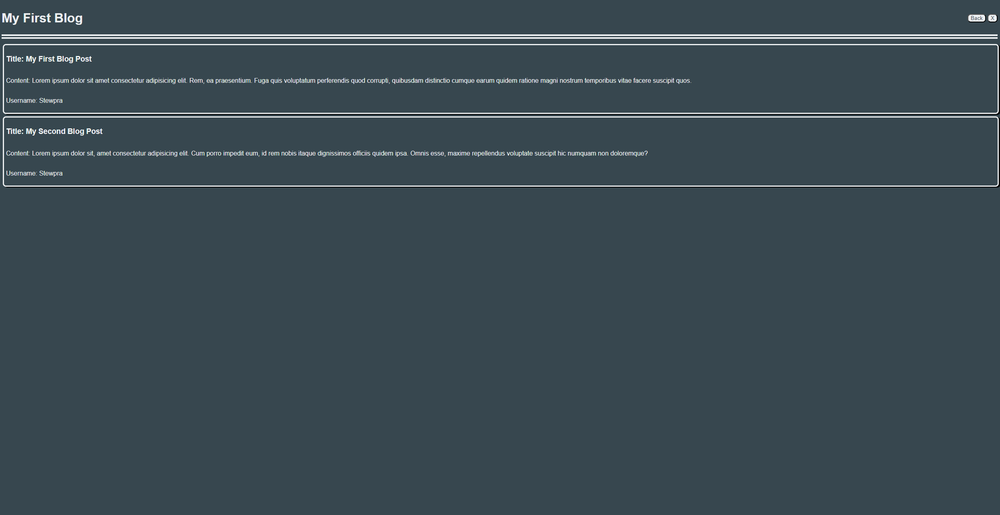

# My first blog

## Description

With html css and javascript I created a blog page that takes the user input and stores the data in local storage. The posts are then formated and placed on the blog page. It was fun practice getting used to working with the three lanugages. I learned alot about all three but because it was my first project with JavaScript it was definetly a huge learning curve. After completing this project my confidence with JS has skyrocketed.

## Usage

The above image is the landing page of the blog in light mode. The moon button controls a toggle for light and dark mode. The user inputs their information in the fields to the right. After filling out the information and hitting submit the information is stored in local storage. The submit button also redirects the user to the blog post page where they can see their newest post alongside their previous posts.

the above image is the aforementioned blog page where the user can see all their posts. The page is also in the dark mode. Along side the dark mode toggle there is a back button which will take the user back to the landing page.
